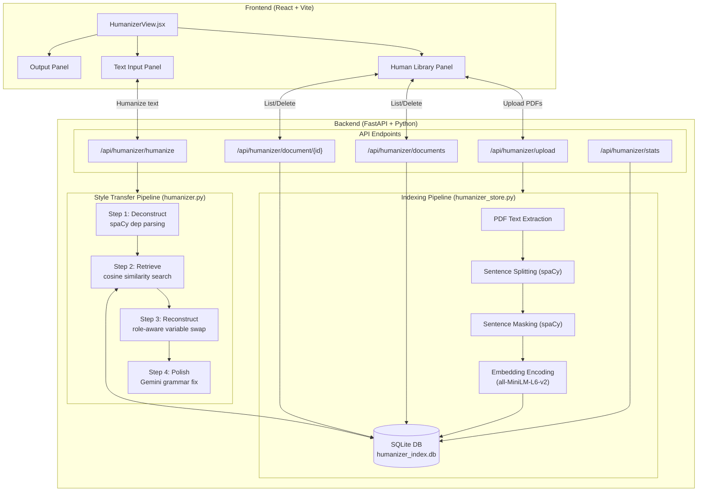
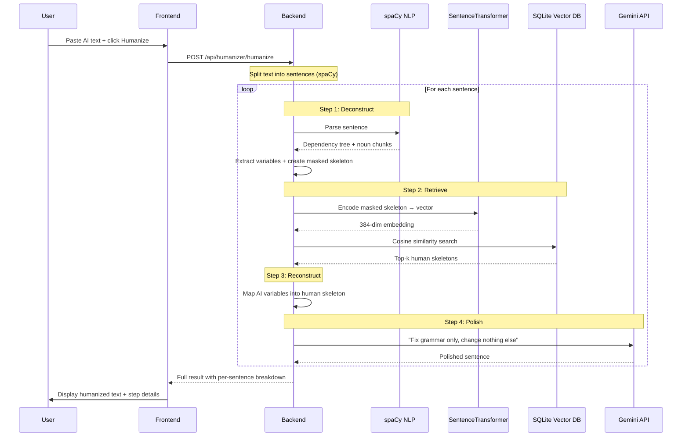
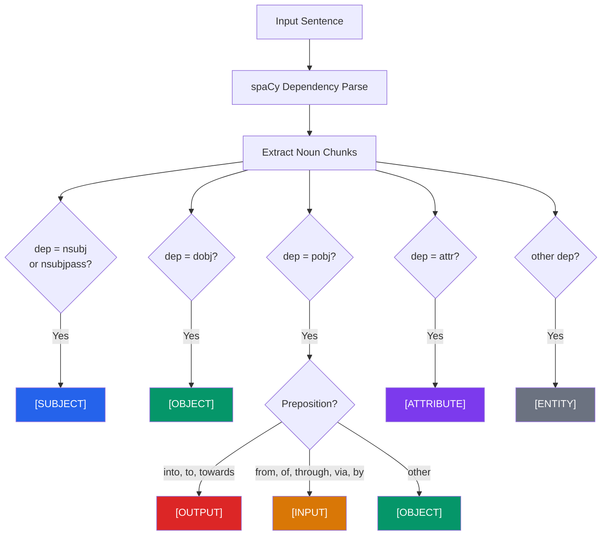
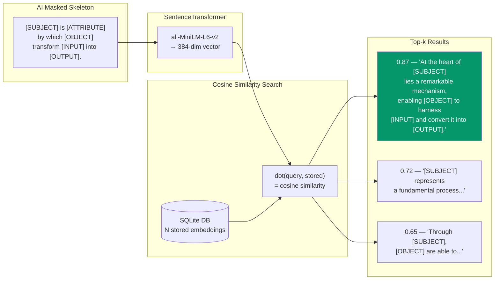
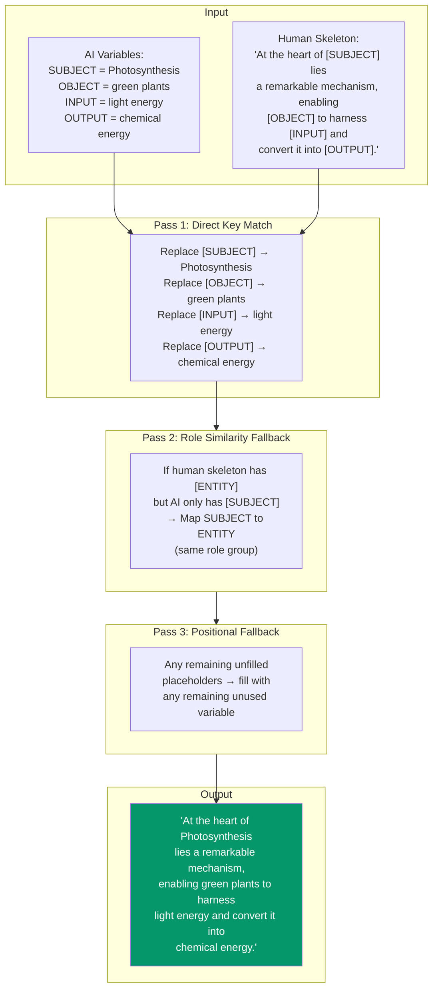
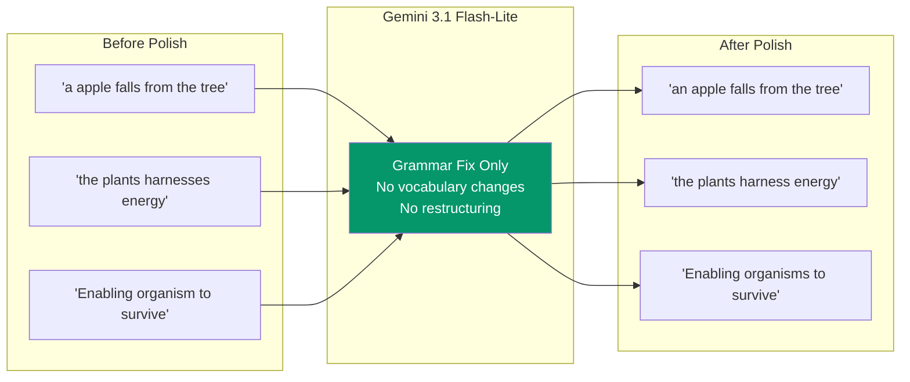
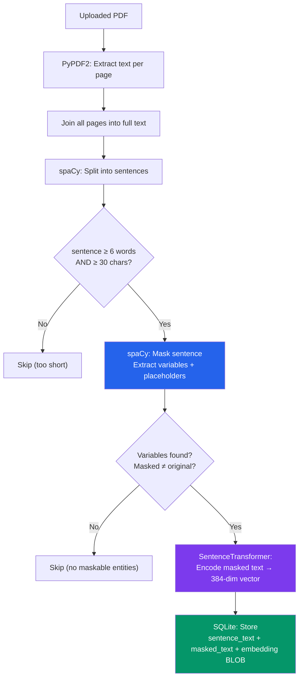
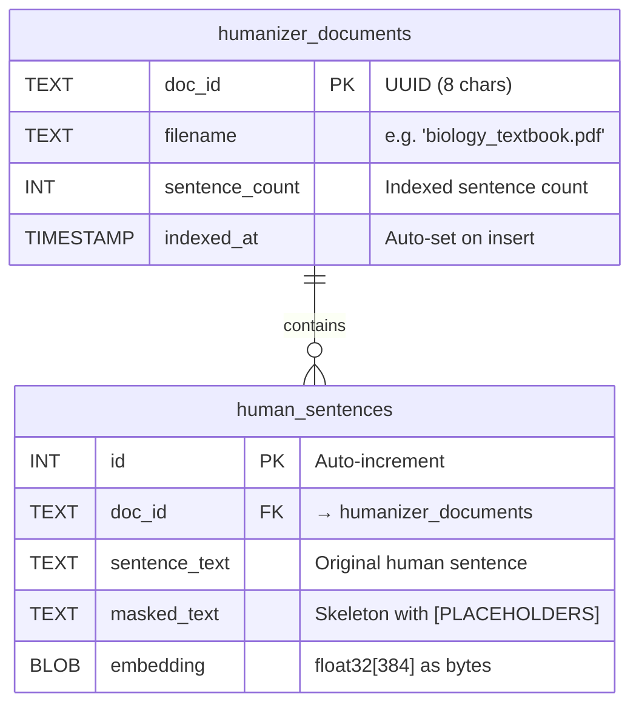
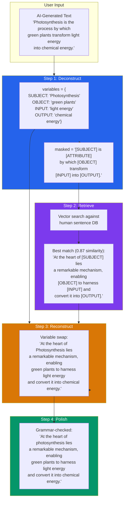
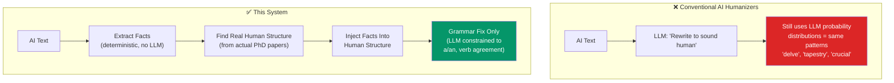

# AI-to-Human Style Transfer Engine — Technical Documentation

> **System**: Writing Tools — AI Humanizer Module
> **Version**: 1.0
> **Last Updated**: 2026-03-07

---

## Table of Contents

1. [System Overview](#system-overview)
2. [Architecture Diagram](#architecture-diagram)
3. [Pipeline Stages](#pipeline-stages)
4. [Algorithm 1: Sentence Deconstruction (spaCy)](#algorithm-1-sentence-deconstruction)
5. [Algorithm 2: Human Skeleton Retrieval (Sentence Transformers)](#algorithm-2-human-skeleton-retrieval)
6. [Algorithm 3: Variable Reconstruction](#algorithm-3-variable-reconstruction)
7. [Algorithm 4: Grammar Polish (Gemini)](#algorithm-4-grammar-polish)
8. [Human Sentence Indexing Pipeline](#human-sentence-indexing-pipeline)
9. [Data Flow](#data-flow)
10. [Tech Stack & Dependencies](#tech-stack--dependencies)
11. [API Reference](#api-reference)
12. [Why This Beats Conventional AI Humanizers](#why-this-beats-conventional-ai-humanizers)

---

## System Overview

The AI Humanizer is a **4-step style transfer pipeline** that transforms AI-generated text by mathematically mapping its semantic content onto verified human sentence structures extracted from academic PDFs.

> **Core Principle**: Instead of asking an LLM to "rewrite to sound human" (which just produces more LLM-sounding text), this system forces AI content to conform to actual sentence structures written by real human authors — an automated, academic game of Mad Libs.


### The Key Insight

Most AI humanizers operate like this:

```
AI Text → LLM("rewrite this to sound human") → Still AI-Sounding Text
```

This system operates like this:

```
AI Text → Extract Facts → Find Real Human Phrasing → Inject Facts Into Human Structure → Polish
```

The LLM is only used for **grammar correction** at the end — never for rephrasing. The human structure comes directly from real academic authors.

---

## Architecture Diagram



---

## Pipeline Stages

The humanization runs as a **per-sentence pipeline** — each sentence in the input text is independently transformed through all 4 stages.



| Stage | Name | Engine | Purpose |
| --- | --- | --- | --- |
| 1 | Deconstruct | **spaCy** `en_core_web_sm` | Extract entities by syntactic role, create masked skeleton |
| 2 | Retrieve | **SentenceTransformer** `all-MiniLM-L6-v2` | Find closest human sentence skeleton via cosine similarity |
| 3 | Reconstruct | **Python** (role-aware mapping) | Slot AI's facts into the human's sentence structure |
| 4 | Polish | **Gemini** `gemini-3.1-flash-lite-preview` | Fix grammar friction without changing vocabulary |

---

## Algorithm 1: Sentence Deconstruction

**Function**: `deconstruct_sentence(sentence: str) → dict`
**Engine**: spaCy `en_core_web_sm` (dependency parser)

### Purpose

Programmatically separate a sentence into its **semantic content** (the "meat" — facts, entities, topics) and its **syntactic structure** (the "skeleton" — how those facts are arranged grammatically).

### Role Extraction Rules



### Algorithm

```
INPUT: "Photosynthesis is the process by which green plants transform light energy into chemical energy."
OUTPUT: {
  "masked": "[SUBJECT] is [ATTRIBUTE] by which [OBJECT] transform [INPUT] into [OUTPUT].",
  "variables": {
    "SUBJECT": "Photosynthesis",
    "ATTRIBUTE": "the process",
    "OBJECT": "green plants",
    "INPUT": "light energy",
    "OUTPUT": "chemical energy"
  }
}

ALGORITHM:
1. Parse sentence with spaCy → dependency tree
2. FOR each noun chunk in the sentence:
   a. Skip pronouns (pos_ == "PRON")
   b. Read the root token's dependency label (dep_)
   c. Map dep_ to role using the Role Extraction Rules
   d. Handle duplicate roles by numbering: OBJECT, OBJECT_2, OBJECT_3...
   e. Record (start_char, end_char, placeholder) for each chunk
3. Sort replacements by position (reverse order to preserve indices)
4. Replace each chunk with its placeholder in the original text
5. RETURN { masked, variables }
```

### Dependency-to-Role Mapping Table

| spaCy `dep_` | Assigned Role | Example |
| --- | --- | --- |
| `nsubj`, `nsubjpass` | `[SUBJECT]` | "**Photosynthesis** is..." |
| `dobj` | `[OBJECT]` | "...transform **light energy**" |
| `pobj` + prep `into/to/towards` | `[OUTPUT]` | "...into **chemical energy**" |
| `pobj` + prep `from/of/through/via/by` | `[INPUT]` | "...by which **green plants**" |
| `pobj` + other prep | `[OBJECT]` | "...in **the cell**" |
| `attr` | `[ATTRIBUTE]` | "...is **the process**" |
| anything else | `[ENTITY]` | fallback catch-all |

---

## Algorithm 2: Human Skeleton Retrieval

**Function**: `retrieve_human_skeleton(masked_ai_sentence: str, top_k: int) → list`
**Engine**: SentenceTransformer `all-MiniLM-L6-v2` (384-dimensional embeddings)

### Purpose

Search the pre-indexed database of human sentences (from uploaded PDFs) to find the one whose **masked skeleton** is most structurally similar to the AI's masked skeleton. This is a semantic similarity search — not keyword matching.

### How It Works



### Algorithm

```
INPUT: masked_ai_sentence (string with [PLACEHOLDER] slots)
OUTPUT: list of {masked_text, sentence_text, similarity} sorted by similarity

1. Encode the masked AI sentence:
   query_vector = SentenceTransformer.encode(masked_ai_sentence)  → float32[384]
   Normalize to unit length

2. Load ALL stored human sentence embeddings from SQLite

3. FOR each stored embedding:
   similarity = dot_product(query_vector, stored_vector)
   (equivalent to cosine similarity because both are L2-normalized)

4. Sort by similarity descending

5. RETURN top_k results with:
   - masked_text: the human skeleton with placeholders
   - sentence_text: the original human sentence (for display)
   - similarity: cosine similarity score (0.0 to 1.0)
```

### Why Sentence Transformers (Not TF-IDF / BM25)?

| Method | What it compares | Problem |
| --- | --- | --- |
| TF-IDF / BM25 | Exact word overlap | `[SUBJECT]` would only match `[SUBJECT]` — no structural understanding |
| Sentence Transformers | **Semantic meaning** | "X is transformed by Y into Z" matches "Y converts X to Z" even with different words |

The Sentence Transformer understands that `"[SUBJECT] is [ATTRIBUTE] by which [OBJECT] transform [INPUT] into [OUTPUT]"` is structurally similar to `"At the heart of [SUBJECT] lies a mechanism enabling [OBJECT] to harness [INPUT] and convert it into [OUTPUT]"` — because both describe a **transformative process with the same role structure**.

---

## Algorithm 3: Variable Reconstruction

**Function**: `reconstruct_sentence(human_skeleton: str, variables: dict) → str`

### Purpose

Take the AI's extracted variables and slot them into the human skeleton. This is the "Mad Libs" step — same facts, completely different sentence structure.

### Reconstruction Strategy



### Three-Pass Algorithm

```
INPUT:
  human_skeleton: "At the heart of [SUBJECT] lies a mechanism, enabling [ACTOR] to harness [INPUT]..."
  variables: {"SUBJECT": "Photosynthesis", "OBJECT": "green plants", "INPUT": "light energy", "OUTPUT": "chemical energy"}

OUTPUT: reconstructed sentence with all placeholders filled

PASS 1 — Direct Key Match:
  FOR each (key, value) in variables:
    IF "[{key}]" exists in human_skeleton:
      Replace first occurrence of "[{key}]" with value
      Mark key as used

PASS 2 — Role Similarity Fallback:
  Extract remaining unfilled placeholders from result
  Get unused variables (not matched in Pass 1)

  Role groups (priority-ordered):
    subject: [SUBJECT, ENTITY, ATTRIBUTE]
    actor:   [ACTOR, SUBJECT]
    object:  [OBJECT, ENTITY, OUTPUT, ATTRIBUTE]
    input:   [INPUT, OBJECT, ENTITY]
    output:  [OUTPUT, OBJECT, ENTITY]

  FOR each unfilled placeholder:
    Get its base role (strip trailing _2, _3 etc.)
    Look up the role group for that base role
    Find an unused variable whose base role matches any in the group
    IF found → replace placeholder, remove from unused

PASS 3 — Positional Fallback:
  FOR any still-unfilled placeholders:
    Fill with the first available unused variable (any role)
```

### Role Group Mapping

| Unfilled Placeholder | Will Accept Variable From |
| --- | --- |
| `[SUBJECT]` | SUBJECT → ENTITY → ATTRIBUTE |
| `[ACTOR]` | ACTOR → SUBJECT |
| `[OBJECT]` | OBJECT → ENTITY → OUTPUT → ATTRIBUTE |
| `[INPUT]` | INPUT → OBJECT → ENTITY |
| `[OUTPUT]` | OUTPUT → OBJECT → ENTITY |
| `[ENTITY]` | ENTITY → SUBJECT → OBJECT → ATTRIBUTE |
| `[ATTRIBUTE]` | ATTRIBUTE → ENTITY → OBJECT |

---

## Algorithm 4: Grammar Polish

**Function**: `polish_sentence(sentence: str) → str`
**Engine**: Gemini `gemini-3.1-flash-lite-preview`

### Purpose

After variable swapping, the reconstructed sentence may have minor grammatical friction — wrong articles ("a" vs "an"), subject-verb disagreement, or awkward punctuation. The LLM fixes **only grammar**, never vocabulary or structure.

### Strict Prompt Design

```
┌──────────────────────────────────────────────────────────────┐
│  You are a grammar-only proofreader. Your ONLY job is to    │
│  fix mechanical grammar errors in the sentence below.        │
│                                                              │
│  ALLOWED fixes (and NOTHING else):                           │
│    • Subject-verb agreement                                  │
│    • Article correction (a/an)                               │
│    • Pronoun case errors                                     │
│    • Capitalization at sentence start                         │
│    • Missing or extra punctuation                            │
│                                                              │
│  STRICTLY FORBIDDEN:                                         │
│    • Do NOT rewrite or rephrase any part                     │
│    • Do NOT change sentence structure or word order           │
│    • Do NOT add/remove/substitute words                      │
│    • Do NOT change the vocabulary in any way                 │
│    • Do NOT add explanations or quotation marks              │
│                                                              │
│  If already correct, return EXACTLY as-is.                    │
│                                                              │
│  Sentence: {reconstructed_sentence}                          │
│                                                              │
│  Return ONLY the corrected sentence. Nothing else.           │
└──────────────────────────────────────────────────────────────┘
```

### Why Use an LLM Here?



The LLM is constrained to a **single, narrow task** — it never generates creative content, only fixes mechanical grammar issues.

---

## Human Sentence Indexing Pipeline

Before the style transfer pipeline can run, the system needs a database of human sentence structures. This is built by uploading PDFs.

**Function**: `humanizer_store.index_document(filename, pages_text) → dict`

### Indexing Flow



### Storage Schema



### Embedding Details

| Property | Value |
| --- | --- |
| Model | `all-MiniLM-L6-v2` |
| Dimensions | 384 |
| Normalization | L2-normalized (unit vectors) |
| Storage | `float32` array → raw bytes BLOB |
| Similarity | `dot_product(a, b)` = cosine similarity (since normalized) |
| Speed | ~50ms per sentence on CPU |

---

## Data Flow

### Complete End-to-End Flow



### Response Object Structure

```json
{
  "original_text": "Photosynthesis is the process by which...",
  "humanized_text": "At the heart of photosynthesis lies...",
  "sentences": [
    {
      "original": "Photosynthesis is the process by which...",
      "humanized": "At the heart of photosynthesis lies...",
      "skipped": false,
      "steps": {
        "deconstruct": {
          "masked": "[SUBJECT] is [ATTRIBUTE] by which [OBJECT]...",
          "variables": {"SUBJECT": "Photosynthesis", "OBJECT": "green plants", ...}
        },
        "retrieve": {
          "human_skeleton": "At the heart of [SUBJECT] lies...",
          "original_human": "At the heart of evolution lies...",
          "similarity": 0.8723
        },
        "reconstruct": {
          "raw_output": "At the heart of Photosynthesis lies..."
        },
        "polish": {
          "final_output": "At the heart of photosynthesis lies..."
        }
      }
    }
  ],
  "stats": {
    "total_sentences": 1,
    "humanized_count": 1,
    "skipped_count": 0
  }
}
```

---

## Tech Stack & Dependencies

| Component | Technology | Role |
| --- | --- | --- |
| NLP Parser | **spaCy** `en_core_web_sm` (12 MB) | Dependency parsing, sentence splitting, entity extraction |
| Embeddings | **SentenceTransformer** `all-MiniLM-L6-v2` (80 MB) | Semantic encoding of masked sentences into 384-dim vectors |
| Vector Math | **NumPy** | Cosine similarity computation |
| Deep Learning | **PyTorch** (~2 GB) | Backend for SentenceTransformers (CPU mode) |
| Vector Storage | **SQLite** (humanizer_index.db) | Stored embeddings as BLOB, metadata tables |
| Grammar Polish | **Gemini** `gemini-3.1-flash-lite-preview` | Grammar-only correction (minimal thinking), reuses existing API key rotation |
| PDF Parsing | **PyPDF2** (already installed) | Page-by-page text extraction |

### Lazy Loading Strategy

Both spaCy and SentenceTransformers are **lazy-loaded** — they only initialize on first use. This means:

- Server startup is fast (no 2-second model loading delay)
- Memory is only allocated when the humanizer is first used
- Subsequent calls reuse the cached models

---

## API Reference

| Method | Endpoint | Description |
| --- | --- | --- |
| `POST` | `/api/humanizer/upload` | Upload PDFs to index human sentences |
| `POST` | `/api/humanizer/humanize` | Run style transfer on AI text |
| `GET` | `/api/humanizer/documents` | List indexed documents |
| `DELETE` | `/api/humanizer/document/{doc_id}` | Remove a document |
| `GET` | `/api/humanizer/stats` | Get sentence/document counts |

### POST `/api/humanizer/upload`

**Request**: `multipart/form-data` with `files` field (one or more PDFs)

**Response**:

```json
{
  "indexed": [{"doc_id": "a1b2c3d4", "filename": "textbook.pdf", "sentence_count": 847}],
  "errors": []
}
```

### POST `/api/humanizer/humanize`

**Request**:

```json
{"text": "Photosynthesis is the process by which green plants transform light energy into chemical energy."}
```

**Response**: See [Response Object Structure](#response-object-structure) above.

---

## Why This Beats Conventional AI Humanizers



| Approach | How It Works | Weakness |
| --- | --- | --- |
| **QuillBot / basic paraphrasers** | Synonym swapping | Shallow — same structure, different words |
| **"Humanize with AI" tools** | Ask LLM to rewrite | LLMs can only produce LLM-sounding text |
| **This system** | Force AI content into verified human structures | Requires a library of human PDFs (but that's a feature, not a bug) |

The critical difference: **the sentence structure itself** — the word order, the rhetorical flow, the subordinate clause placement — comes from a real human author, not from an LLM's probability distribution. AI detectors primarily flag structural patterns, not vocabulary. By using a human's actual structure, the output is mathematically congruent with human-written text.
