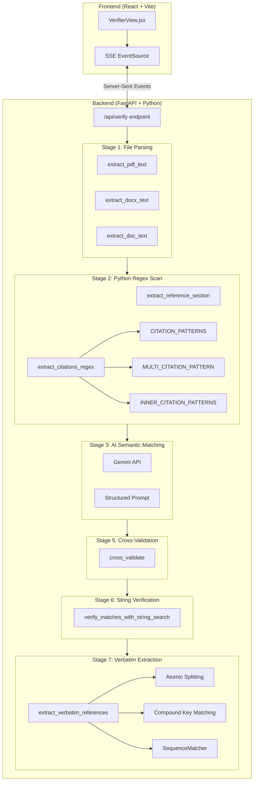
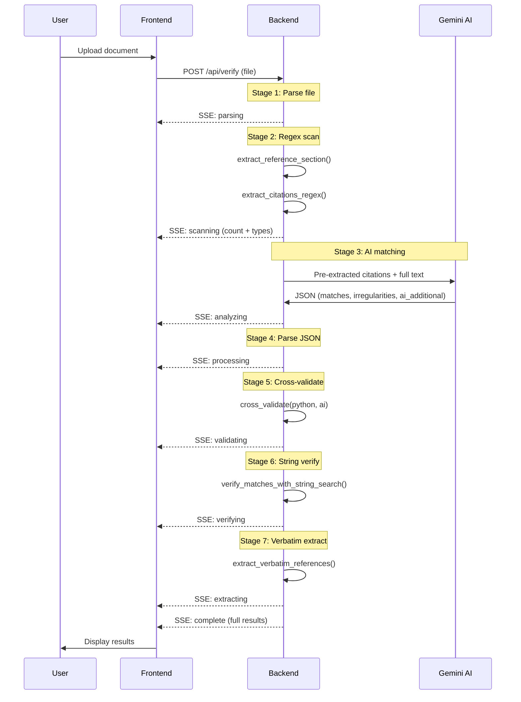
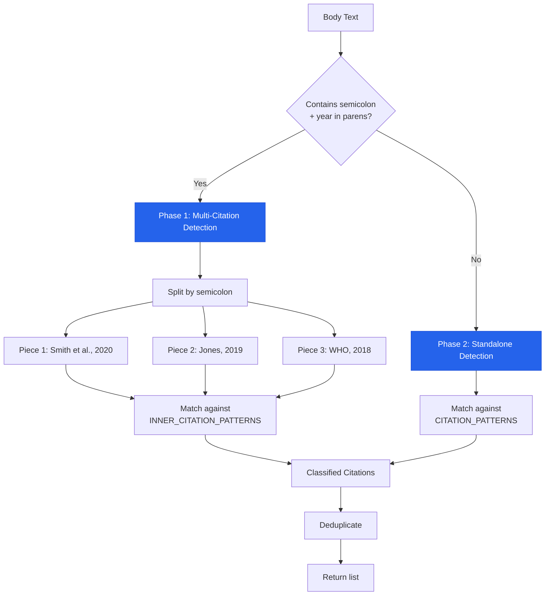
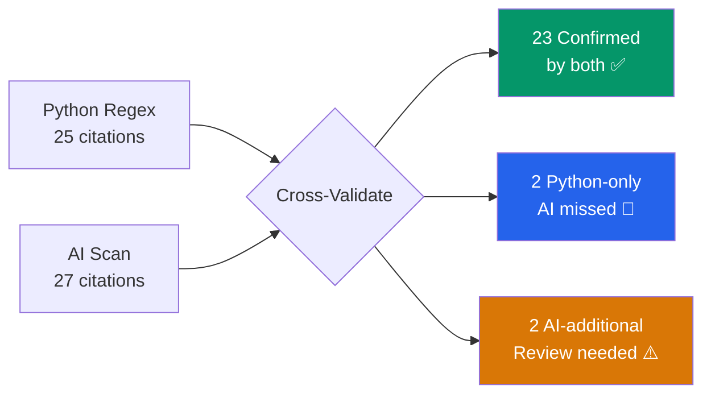
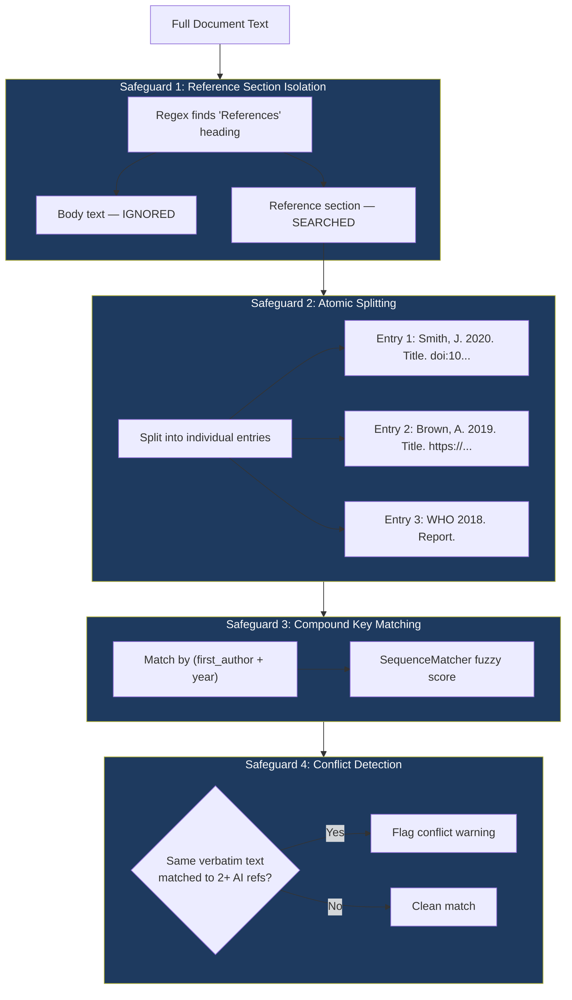
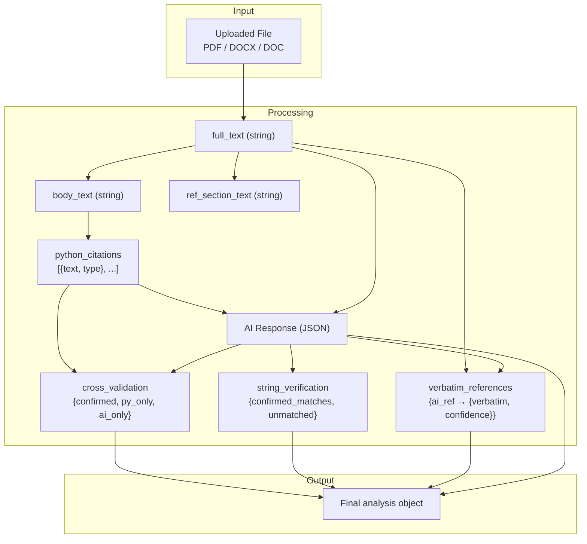
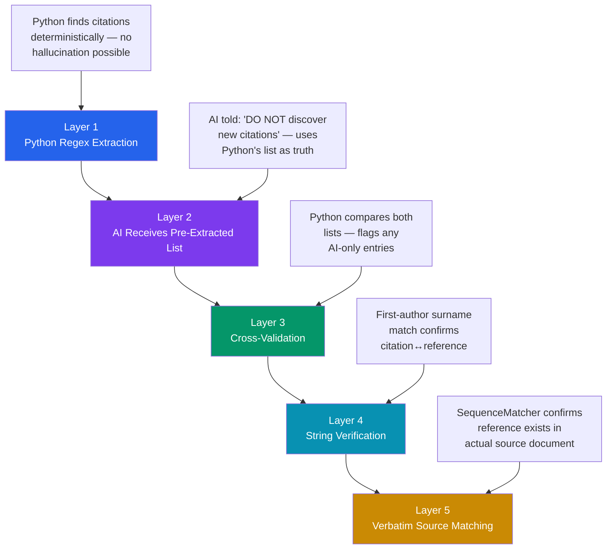

# Citation Verifier — Technical Documentation

> **System**: Writing Tools — Citation Verifier Module
> **Version**: 2.0 (Python-Guided Extraction)
> **Last Updated**: 2026-03-01

---

## Table of Contents

1. [System Overview](#system-overview)
2. [Architecture Diagram](#architecture-diagram)
3. [Pipeline Stages](#pipeline-stages)
4. [Algorithm 1: Python Citation Extraction](#algorithm-1-python-citation-extraction)
5. [Algorithm 2: Reference Section Isolation](#algorithm-2-reference-section-isolation)
6. [Algorithm 3: AI Semantic Matching](#algorithm-3-ai-semantic-matching)
7. [Algorithm 4: Cross-Validation](#algorithm-4-cross-validation)
8. [Algorithm 5: String Verification](#algorithm-5-string-verification)
9. [Algorithm 6: Verbatim Reference Extraction](#algorithm-6-verbatim-reference-extraction)
10. [Regex Pattern Reference](#regex-pattern-reference)
11. [Data Flow](#data-flow)
12. [Anti-Hallucination Safeguards](#anti-hallucination-safeguards)

---

## System Overview

The Citation Verifier is a hybrid **Python + AI** system that detects, matches, and verifies academic citations within uploaded documents (PDF, DOCX, DOC). The core design principle is:

> **Python handles deterministic tasks (zero hallucination risk). AI handles semantic tasks (understanding, matching, irregularity detection). Neither is trusted alone — both cross-validate each other.**


---

## Architecture Diagram



---

## Pipeline Stages

The verification runs as a **streaming SSE pipeline** with 7 stages. Each stage emits progress events to the frontend in real-time.

| Stage | Name | Engine | SSE Key | Purpose |
| --- | --- | --- | --- | --- |
| 1 | File Parsing | Python | `parsing` | Magic byte detection → text extraction |
| 2 | Regex Scan | **Python** | `scanning` | 16 regex patterns extract all citations |
| 3 | AI Matching | **Gemini** | `analyzing` | Semantic matching with pre-extracted data |
| 4 | Response Parse | Python | `processing` | JSON response parsing |
| 5 | Cross-Validation | **Python** | `validating` | Compare Python vs AI results |
| 6 | String Verification | Python | `verifying` | First-author surname matching |
| 7 | Verbatim Extraction | Python | `extracting` | Fuzzy-match source document text |



---

## Algorithm 1: Python Citation Extraction

**Function**: `extract_citations_regex(body_text: str) → list`

### Purpose

Deterministically extract all in-text citations from the document body using regex patterns. This eliminates AI hallucination risk for citation discovery.

### Two-Phase Strategy



### Algorithm Steps

```
INPUT: body_text (string — document body without reference section)
OUTPUT: list of {text, type} dicts

1. Initialize found_citations = [], seen_texts = set(), matched_spans = []

2. PHASE 1 — Multi-Citation Blocks:
   FOR each match of MULTI_CITATION_PATTERN in body_text:
     a. Skip if span overlaps with already-matched span
     b. Record span as matched
     c. Strip outer parentheses: "(Smith, 2020; Jones, 2019)" → "Smith, 2020; Jones, 2019"
     d. Split by semicolon → ["Smith, 2020", "Jones, 2019"]
     e. FOR each piece:
        i.   Try each INNER_CITATION_PATTERN
        ii.  If match found → add to results with type label
        iii. If no match but contains a year → add as type "UNKNOWN"
        iv.  Deduplicate via seen_texts set

3. PHASE 2 — Standalone Citations:
   FOR each (pattern, label) in CITATION_PATTERNS:
     FOR each match of pattern in body_text:
       a. Skip if span overlaps with already-matched span
       b. Add to results if not in seen_texts
       c. Record span as matched

4. RETURN found_citations
```

### Overlap Prevention

The algorithm maintains a `matched_spans` list to prevent double-matching. For example, if `(Smith, 2020; Jones, 2019)` is matched as a multi-citation in Phase 1, the individual `(Smith, 2020)` inside it won't be matched again in Phase 2.

---

## Algorithm 2: Reference Section Isolation

**Function**: `extract_reference_section(full_text: str) → tuple`

### Purpose

Split the document into **body text** (where citations live) and **reference section** (where full references live). This prevents citation regex from matching inside the reference list itself.

### Algorithm

```
INPUT: full_text (entire document)
OUTPUT: (body_text, reference_text)

1. Search for heading patterns (case-insensitive):
   - "References"
   - "Bibliography"
   - "Works Cited"
   - "Reference List"

2. IF heading found:
   - body_text = everything BEFORE the heading
   - reference_text = everything AFTER the heading
   - RETURN (body_text, reference_text)

3. IF no heading found:
   - RETURN (full_text, "")  — treat entire text as body
```

---

## Algorithm 3: AI Semantic Matching

**Engine**: Google Gemini (`gemini-3-flash-preview`)

### Purpose

The AI receives **pre-extracted citations** from Python and performs semantic tasks that regex cannot:

- Extracting full references from the reference section
- Matching citations to their corresponding references
- Detecting irregularities (date mismatches, name misspellings)
- **Independently scanning** for citations Python may have missed

### Prompt Structure

```
┌─────────────────────────────────────────────────┐
│  ROLE: Citation verification assistant          │
│                                                 │
│  INPUT:                                         │
│    • Pre-extracted citations (JSON list)         │
│    • Full document text                          │
│                                                 │
│  TASKS:                                         │
│    1. Extract reference list from document       │
│    2. Match citations ↔ references               │
│    3. Identify mismatches & irregularities        │
│    4. Independently scan for missed citations     │
│       → Report as "ai_additional_citations"       │
│                                                 │
│  OUTPUT: Strict JSON with:                       │
│    • in_text_citations (echoed from Python)       │
│    • references                                   │
│    • ai_additional_citations (warnings only)      │
│    • missing_references_for_citations             │
│    • unused_references                            │
│    • irregularities                               │
│    • summary                                      │
└─────────────────────────────────────────────────┘
```

### Two-Way Verification



---

## Algorithm 4: Cross-Validation

**Function**: `cross_validate(python_citations, ai_citations, ai_references) → dict`

### Purpose

Compare Python's deterministic extraction against AI's semantic analysis. Flag discrepancies for user review.

### Algorithm

```
INPUT:
  python_citations: list of {text, type} from regex
  ai_citations: list of strings from AI
  ai_references: list of strings from AI

OUTPUT: dict with confirmed_by_both, python_only, ai_only_potential_hallucination

1. Normalize both lists (lowercase, strip whitespace)

2. EXACT MATCH PASS:
   FOR each python citation:
     IF normalized text exists in AI normalized set → CONFIRMED
     ELSE → continue to fuzzy pass

3. FUZZY MATCH PASS:
   FOR each unmatched python citation:
     FOR each AI citation:
       Extract first author from both (regex: [A-Za-z'-]{2,})
       Extract year from both (regex: \d{4})
       IF author match AND year match → CONFIRMED
     IF no fuzzy match → PYTHON_ONLY (AI missed this)

4. REVERSE CHECK:
   FOR each AI citation not in python set:
     Same fuzzy logic as above
     IF no match → AI_ONLY (possible hallucination)

5. RETURN {
     confirmed_by_both: [...],
     python_only: [...],
     ai_only_potential_hallucination: [...]
   }
```

---

## Algorithm 5: String Verification

**Function**: `verify_matches_with_string_search(in_text_citations, references) → dict`

### Purpose

A deterministic first-author surname match between citations and references. Acts as a secondary validation layer.

### Algorithm

```
INPUT: in_text_citations (list), references (list)
OUTPUT: confirmed_matches, unmatched_citations, unmatched_references

1. Build reference groups by first author surname:
   FOR each reference:
     Extract first author (regex: ^[A-Za-z\s'-]+)
     Group by lowercase surname

2. Flag duplicate first names:
   IF multiple references share same first author → record warning

3. Match citations to references:
   FOR each citation:
     Extract first author from citation text
     Search reference groups for matching surname (case-insensitive)
     IF match found → confirmed_match (citation ↔ reference pair)
     ELSE → unmatched_citation

4. Compute unmatched references:
   Any reference not matched by any citation
```

---

## Algorithm 6: Verbatim Reference Extraction

**Function**: `extract_verbatim_references(full_text, ai_references) → dict`

### Purpose

Find the **exact verbatim text** of each reference as it appears in the original document, allowing users to copy references exactly as written. Includes 4 safeguards against DOI bleeding and mixups.

### Safeguard Architecture



### Atomic Splitting Algorithm

The most critical safeguard — prevents DOI/URL from one reference bleeding into the next.

```
INPUT: reference_section (string)
OUTPUT: list of complete, atomic reference entries

1. Define ref_start_pattern — detects the START of a new reference:
   • Surname followed by comma: "Smith,"
   • Numbered: "[1]" or "1. Author"
   • Two capitalized words: "World Health"
   • Surname followed by "(": "Smith ("
   • Single letter + date: "A. (2020)"
   • Single letter + comma: "A,"
   • Year-first: "(2020)"

2. Define continuation_pattern — lines that NEVER start a new reference:
   • "doi:", "https://", "http://"
   • "Available at", "Accessed"
   • "pp.", "p.", "Vol.", "Issue", "Retrieved"

3. FOR each line in reference section:
   IF line matches continuation_pattern:
     → APPEND to current reference entry  (prevents DOI bleed)
   ELSE IF line matches ref_start_pattern:
     → SAVE current entry, START new entry
   ELSE:
     → APPEND to current entry  (continuation of previous)

4. Filter out entries shorter than 20 characters
5. RETURN atomic_refs list
```

### Compound Key Matching

```
FOR each AI reference:
  1. Extract (author, year) from AI reference
  2. FOR each atomic reference from source document:
     a. Extract (author, year) from candidate
     b. IF author matches AND year matches:
        - Compute SequenceMatcher ratio (fuzzy similarity)
        - Track best scoring candidate
  3. IF best_score > threshold:
     - Use best match as verbatim text
     - Record confidence score
  4. Check for conflicts:
     - IF another AI reference already mapped to this same candidate
     - → Flag conflict warning with details
```

---

## Regex Pattern Reference

### Standalone Citation Patterns (`CITATION_PATTERNS`)

| Order | Pattern Label | Matches | Example |
| --- | --- | --- | --- |
| 1 | `ORG_ABBREV` | Organization abbreviations | `(WHO, 2020)` |
| 2 | `INITIALS` | Author with initials | `(J. Smith, 2020)` |
| 3 | `PAR_ETAL` | Et al. parenthetical | `(Smith et al., 2020)` |
| 4 | `PAR_TWO` | Two authors parenthetical | `(Smith and Jones, 2020)` |
| 5 | `PAR_NO_DATE` | No date | `(Smith, n.d.)` |
| 6 | `PAR_SINGLE` | Single author parenthetical | `(Smith, 2020)` |
| 7 | `NAR_ETAL` | Et al. narrative | `Smith et al. (2020)` |
| 8 | `NAR_TWO` | Two authors narrative | `Smith and Jones (2020)` |
| 9 | `NAR_SINGLE` | Single author narrative | `Smith (2020)` |
| 10 | `NUM_MIXED` | Mixed numbered | `[1, 3-5, 7]` |
| 11 | `NUM_SINGLE` | Single numbered | `[1]` |
| 12 | `MLA_PAGE` | MLA author-page | `(Smith 45)` |

> **Order matters** — patterns are evaluated most-specific-first to prevent partial matches.

### Multi-Citation Detection (`MULTI_CITATION_PATTERN`)

Matches any parenthetical block containing a semicolon and at least two years:

```
Pattern: \([^()]*\b\d{4}[a-z]?\b[^()]*;[^()]*\b\d{4}[a-z]?\b[^()]*\)
Example: (Smith et al., 2020; Jones, 2019; WHO, 2018)
```

### Inner Citation Patterns (`INNER_CITATION_PATTERNS`)

Applied to each semicolon-split piece from multi-citation blocks (no outer parentheses):

| Pattern Label | Matches | Example |
| --- | --- | --- |
| `ORG_ABBREV` | Abbreviation + year | `WHO, 2020` |
| `PAR_ETAL` | Et al. + year | `Smith et al., 2020` |
| `PAR_TWO` | Two authors + year | `Smith and Jones, 2020` |
| `PAR_SINGLE` | Single author + year | `Smith, 2020` |
| `YEAR_ONLY` | Year continuation | `2020b` |

### Reference Start Patterns (Atomic Splitting)

| Pattern | Detects | Example |
| --- | --- | --- |
| `Surname,` | Standard author | `Smith,` |
| `[N]` | Numbered (brackets) | `[1]` |
| `N. Author` | Numbered (dot) | `1. Smith` |
| `Word Word` | Organizational name | `World Health` |
| `Surname (` | Name before year | `Smith (` |
| `A. (` | Single letter + date | `A. (2020)` |
| `A,` | Single letter + comma | `A,` |
| `(YYYY)` | Year-first format | `(2020)` |

---

## Data Flow

### Complete Data Schema



### Final Analysis Object Structure

```json
{
  "in_text_citations": ["(Smith, 2020)", "(Jones, 2019)", ...],
  "references": ["Smith, J. (2020) Title...", ...],
  "ai_additional_citations": ["(Lee, 2021)"],
  "missing_references_for_citations": ["(Unknown, 2022)"],
  "unused_references": ["Brown, A. (2018)..."],
  "irregularities": [
    {"type": "date_mismatch", "citation": "Author (2020)", "ref": "Author (2019)", "details": "..."}
  ],
  "num_unique_citations": 25,
  "num_references": 23,
  "python_citations": ["(Smith, 2020)", ...],
  "python_citation_types": {"(Smith, 2020)": "PAR_SINGLE", ...},
  "cross_validation": {
    "confirmed_by_both": ["(Smith, 2020)", ...],
    "python_only": ["(WHO, 2019)"],
    "ai_only_potential_hallucination": [],
    "python_total": 25,
    "ai_total": 24
  },
  "string_verification": {
    "confirmed_matches": [{"citation": "...", "matched_ref": "..."}],
    "unmatched_citations": [],
    "unmatched_references": [],
    "duplicate_first_names": {"Smith": ["ref1", "ref2"]}
  },
  "verbatim_references": {
    "Smith, J. (2020) Title...": {
      "verbatim": "Smith, J. (2020) Exact text from PDF...",
      "confidence": 0.92
    }
  },
  "summary": "Found 25 citations and 23 references..."
}
```

---

## Anti-Hallucination Safeguards

The system implements a **defense-in-depth** strategy against AI hallucination:



| Layer | What it prevents | Mechanism |
| --- | --- | --- |
| Python Regex Extraction | AI inventing citations | Deterministic pattern matching |
| Pre-extracted prompt | AI ignoring/changing citations | Constraints in prompt |
| Cross-validation | Undetected hallucination | Python vs AI comparison |
| AI independent scan | Python missing unusual formats | AI scans with reporting as warnings |
| String verification | Phantom citation-reference pairs | First-author surname matching |
| Verbatim extraction | DOI bleeding, reference mixups | Atomic splitting + compound keys |
