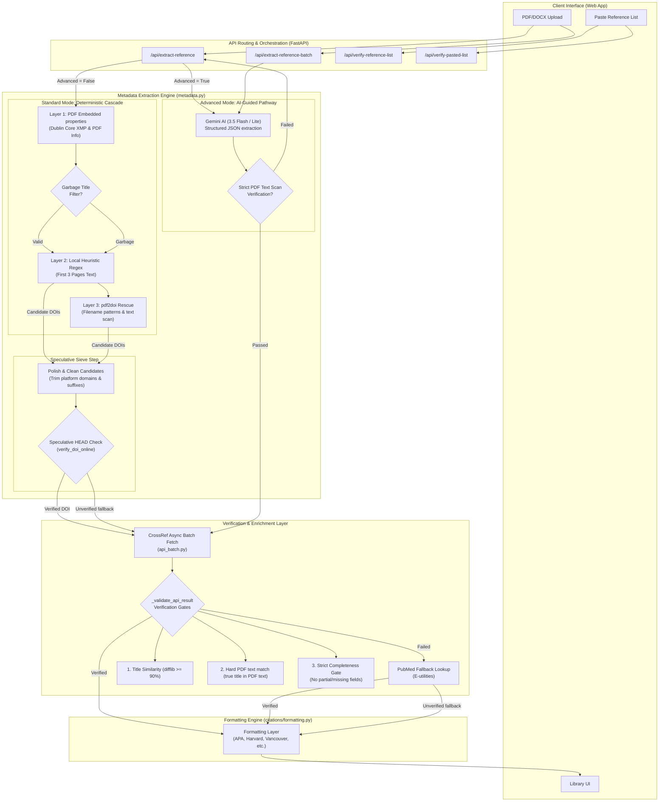
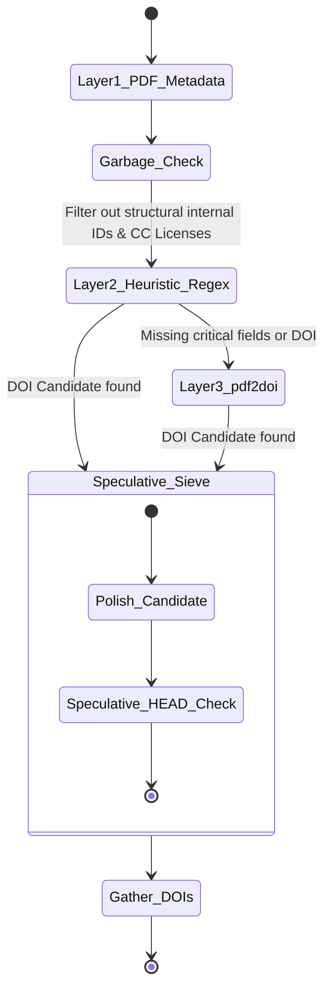
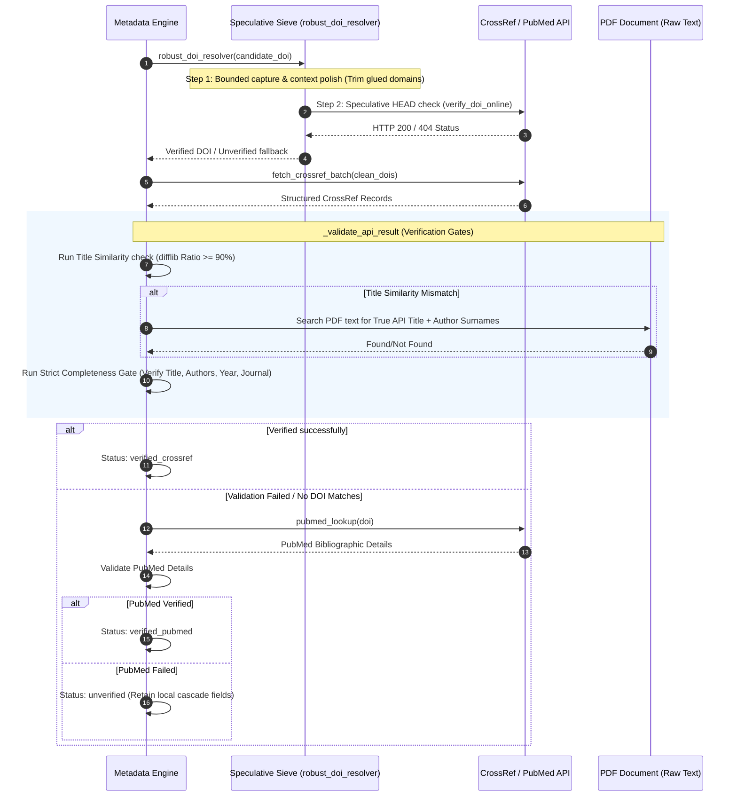
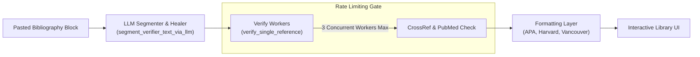

# Reference Generator Architecture

This document outlines the current production architecture and processing pathways of the Reference Generator system within the Library feature. 

The system utilizes an **AI-free, lightweight, high-speed deterministic cascade** for standard extraction, combined with a **Three-Step Speculative Verification Sieve** and an **AI-Guided (Advanced) Pathway** when maximum accuracy is requested. 

No heavyweight local machine learning dependencies (such as PyTorch, spaCy, GROBID, or LayoutLM) are used.

---

## High-Level System Architecture

---

## Core Flow Components

### 1. Document Extraction Pipeline

#### A. Deterministic Cascade Flow (Standard Mode)
The deterministic cascade runs entirely locally on the CPU to extract metadata with zero-API-cost:

##### Cascade Precedence & Merge Logic
When running standard extraction, search layers are executed sequentially to build a candidate list.

1. **Layer 1 (Embedded Properties)** runs first, tapping metadata directly from the PDF dictionary properties and Dublin Core XMP fields.
2. **Layer 2 (Heuristic Regex Parser)** runs next, executing a regex sweep over the first **3 pages** of raw text. **Layer 2 is always executed, even if Layer 1 already found a title or DOI.** This ensures that stale, placeholder, or default embedded metadata (e.g. *"Microsoft Word - Document1.docx"*) is caught, and physical DOIs printed in the document are successfully captured.
3. **Data Merging and Conflict Resolution**:
   * **For standard metadata fields (Title, Authors, Year, etc.)**: The system merges results via a non-overwriting helper: `_merge(base, update, overwrite=False)`. Therefore, fields already populated by Layer 1 take precedence and are **not** overwritten by Layer 2 heuristic extraction.
   * **For Candidate DOIs (The Verification Queue)**: **Layer 2 (text-extracted regex) DOIs take precedence over Layer 1 (embedded) DOIs**. The unique candidates list prioritizes text-extracted candidates, as they are statistically far more accurate.

---

#### B. AI-Guided Flow (Advanced Mode)
Used when explicit precision is required, leveraging LLMs to parse layout-agnostic raw document contents:

1. **Gemini Extraction**: Extracts raw text from the first 3 pages of the PDF and submits it to Gemini with a structured JSON schema.
2. **Anti-Hallucination Verification**: If no valid database lookup successfully verifies, it invokes `strict_ai_verify_against_pdf(ai_data, pdf_path)`. This function scans the raw PDF text to physically confirm that all AI-inferred values (specifically the title, author surnames, and year) are present within the document text. If key details fail this scanner, they are discarded to prevent hallucinated references.

---

### 2. Speculative Sieve & Verification Loop

The newly added **Three-Step Speculative Verification Sieve** sits directly before the bulk lookup calls to CrossRef/PubMed. 

#### Verification Gates (`_validate_api_result`)
To prevent bad metadata or incorrect DOI mappings from overwriting a PDF's local records, every single API-returned metadata block is validated using a multi-signal identity match check. 

1. **Fail-Safe Identity Check**: If the heuristic layers failed to find a local title, author list, or year, the system runs an aggressive local identity parser (`_extract_identity_from_pdf`) to scrape name signals from the page text. If no local identity signal can be gathered, **the system immediately rejects the API record** rather than blindly accepting it.
2. **Completeness Gate**: The system rejects any API record that is missing essential fields (Title, Authors, Year, or Journal/Publisher) to prevent partial/fragmented data from being shown to the user as "verified".
3. **Multi-Signal Verification Checks**:
   * **Title Similarity**: Compares the local title and the API title using `SequenceMatcher`. They must match at a similarity ratio $\ge 90\%$.
   * **Hard PDF Verification (Anti-Hallucination Override)**: If similarity is low due to extraction fragmentation, the system scans the raw text of the actual PDF (`hard_verify_against_pdf`) to physically check if the official API title and first-author surname are verifiably printed inside the document.
   * **Author Surname Overlap**: Extracts and normalizes surnames, requiring at least one matching surname intersection between local PDF metadata and the API response.
   * **Year Match**: Verifies that the publication years match exactly.
4. **Veto and Override Decision Logic**:
   * A title mismatch acts as a **hard veto** and immediately fails validation, **unless** it is overridden by a strong matching signal (first-author surname match) or if the local title is identified as garbage template metadata (e.g. *"Full list of author information"*).
   * **If validation fails**: The metadata is **not** overwritten. The original heuristic data is retained and labeled as `unverified` so that no incorrect reference records are introduced.

---

### 3. Pasted Reference List Pipeline
When a user pastes a raw bibliography text block into the Library interface:

